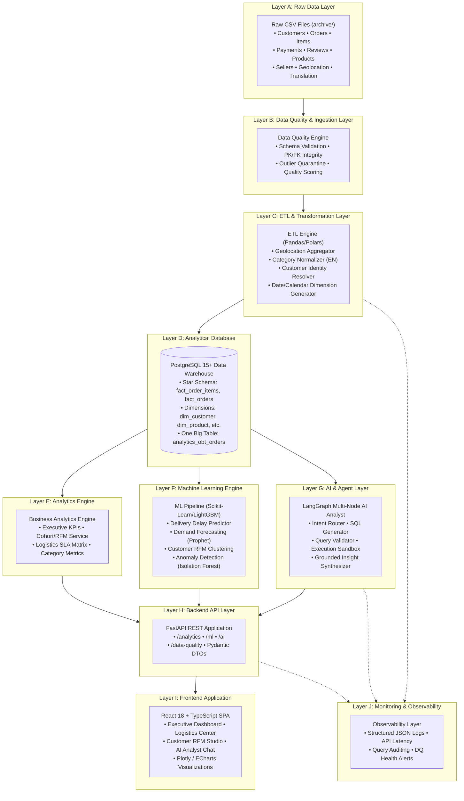

# OlistIQ — Enterprise Technical Architecture Document
## AI-Powered E-Commerce Decision Intelligence Platform

**Project Name:** OlistIQ  
**Architect:** Antigravity Data Intelligence & Architecture  
**Status:** Approved Technical Architecture  
**Target Release:** Production Phase 1  
**Date:** September 2026  

---

## Table of Contents
1. [Project Overview & Business Problem](#1-project-overview--business-problem)
2. [Solution Overview](#2-solution-overview)
3. [System Architecture & 10-Layer Design](#3-system-architecture--10-layer-design)
4. [Technology Stack Decisions](#4-technology-stack-decisions)
5. [Data Architecture & Dimensional Modeling](#5-data-architecture--dimensional-modeling)
6. [ETL & Data Transformation Pipeline](#6-etl--data-transformation-pipeline)
7. [Data Quality & Validation Framework](#7-data-quality--validation-framework)
8. [Analytics & Decision Intelligence Engine](#8-analytics--decision-intelligence-engine)
9. [Machine Learning Engine & Predictive Models](#9-machine-learning-engine--predictive-models)
10. [AI Analyst Agent Architecture (LangGraph)](#10-ai-analyst-agent-architecture-langgraph)
11. [Feature Engineering & Feature Store Strategy](#11-feature-engineering--feature-store-strategy)
12. [Backend Architecture (FastAPI)](#12-backend-architecture-fastapi)
13. [Frontend Architecture (React + TypeScript)](#13-frontend-architecture-react--typescript)
14. [Frontend $\leftrightarrow$ Backend API Contract Overview](#14-frontend--backend-api-contract-overview)
15. [Security, Governance & Data Safety](#15-security-governance--data-safety)
16. [Observability, Logging & Health Monitoring](#16-observability-logging--health-monitoring)
17. [Project Directory Structure](#17-project-directory-structure)
18. [Implementation Sequence & Phase Roadmap](#18-implementation-sequence--phase-roadmap)

---

## 1. Project Overview & Business Problem

Modern multi-merchant e-commerce marketplaces suffer from fragmented operational visibility, unpredictable logistics delays across continental geographies, asymmetric merchant performance, and slow decision-making workflows.

The **Olist Brazilian E-Commerce Ecosystem** captures over 100,000 real-world customer orders across 27 Brazilian states from 2016 to 2018. The core business challenges reflected in the data include:
- **Logistics Friction:** High cross-state delivery transit times (average 12+ days) and volatile carrier delays.
- **Merchant Quality Variance:** Diverse seller dispatch speeds leading to customer dissatisfaction.
- **Customer Churn:** Low repeat purchase behavior (~3.12%), necessitating precision customer segmentation.
- **Decision Bottlenecks:** Executive and operational teams lack a real-time, AI-assisted decision intelligence interface capable of grounded natural language querying and predictive risk forecasting.

---

## 2. Solution Overview

**OlistIQ** is an enterprise-grade AI-powered Decision Intelligence Platform. Rather than serving as a static dashboard or simple chatbot, OlistIQ combines:
1. **A Cleaned Dimensional Data Warehouse:** Star-schema optimized for sub-second analytical aggregations.
2. **Predictive Machine Learning Engines:** Pre-trained risk models forecasting delivery delays, cancellation probabilities, and demand volume.
3. **An Autonomous AI Analyst (LangGraph):** A grounded NL2SQL reasoning agent executing sanitized queries against the database without numerical hallucinations.
4. **An Executive Decision Cockpit (React + TypeScript):** A 10-module analytics dashboard presenting live KPIs, geospatial delivery heatmaps, seller leaderboards, and interactive scenario simulators.

---

## 3. System Architecture & 10-Layer Design



---

## 4. Technology Stack Decisions

| Component | Selected Technology | Rationale & Practical Justification |
| :--- | :--- | :--- |
| **Backend Framework** | **Python 3.11 + FastAPI** | High-performance asynchronous REST framework with native Pydantic schema validation and OpenAPI documentation. |
| **Data Processing** | **Pandas & NumPy** | Fast vectorized ETL transformations, geospatial haversine distance calculations, and dataset normalization. |
| **Database** | **PostgreSQL 15+** | Robust ACID relational warehouse supporting complex window functions, dimensional indexing, and sub-second analytical SQL. |
| **Machine Learning** | **Scikit-Learn + LightGBM** | Fast gradient boosted decision trees for tabular classification/regression and KMeans for RFM customer segmentation. |
| **Time Series** | **Prophet / Statsmodels** | Interpretable seasonal demand forecasting with Brazilian holiday support. |
| **AI Orchestration** | **LangGraph & LangChain** | Deterministic multi-node graph workflow enforcing validation loops and zero numerical hallucinations. |
| **Frontend Platform** | **React 18 + TypeScript + Vite** | Strongly-typed, component-based dashboard with fast HMR and modular state management. |
| **Data Visualization** | **Plotly.js / Chart.js / Lucide Icons** | Interactive zoomable time-series charts, geospatial choropleths, and enterprise gauge cards. |

---

## 5. Data Architecture & Dimensional Modeling

*(See full specification in [docs/DATABASE_DESIGN.md](file:///c:/Users/Hariharan%20K/OneDrive/Desktop/IBM_INTERN_PROJECT/docs/DATABASE_DESIGN.md))*

### Core Schema Design Summary
- **`fact_order_items` (Line Item Grain):** `order_id` + `order_item_id`. Stores item price, freight, seller lead time, carrier transit duration, distance in km, and delay flags.
- **`fact_orders` (Order Summary Grain):** Consolidated basket values, payment totals, discrepancy tracking, and review score integration.
- **`dim_customer` (Customer Grain):** Keyed on `customer_unique_id` (not transient `customer_id`). Computes lifetime spend, order frequency, recency, and RFM segment.
- **`dim_product` (Product Grain):** Standardized English category mappings (`pc_gamer`, `portable_kitchen_food_preparers`), physical volume, density, and size tiers.
- **`dim_seller` (Seller Grain):** Merchant location, dispatch speed averages, and SLA breach rate.
- **`dim_geolocation` (Postal Prefix Grain):** Deduplicated, boundary-cleaned coordinates per 5-digit zip code.
- **`analytics_obt_orders` (Materialized One Big Table):** Pre-joined denormalized table powering instant analytical dashboards and AI SQL queries.

---

## 6. ETL & Data Transformation Pipeline

The ETL pipeline runs as an idempotent, multi-stage DAG:

```
[Raw CSV Ingestion]
        ↓
[Schema & Type Validation]
        ↓
[Data Cleansing & Normalization]
  • Deduplicate & bound Geolocation (Lat: [-33.75, 5.27], Lng: [-73.98, -34.79])
  • Impute missing English category translations
  • Clean review duplicates & resolve customer_unique_id
        ↓
[Feature Engineering & Metric Computation]
  • Haversine distance (Customer Zip ↔ Seller Zip)
  • Fulfillment milestones (Dispatch hours, Transit days, Late flags)
  • RFM scores & Customer segment classification
        ↓
[Dimension Table Loading] (dim_customer, dim_product, dim_seller, dim_date, dim_geolocation)
        ↓
[Fact Table Loading] (fact_order_items, fact_orders, fact_payments, fact_reviews)
        ↓
[Materialized View Refresh] (analytics_obt_orders)
        ↓
[Data Quality Verification & Pipeline Logging]
```

---

## 7. Data Quality & Validation Framework

The framework executes automated data-assertion suites during every pipeline run:

| Check Category | Validation Rule | Action on Failure |
| :--- | :--- | :--- |
| **Primary Key Uniqueness** | `order_id`, `product_id`, `seller_id`, `customer_unique_id` must be 100% unique. | **PIPELINE ERROR / HALT** |
| **Referential Integrity** | All `order_items` must reference existing products, sellers, and customer records. | **PIPELINE ERROR** |
| **Numeric Range Constraints** | `price >= 0`, `freight_value >= 0`, `review_score BETWEEN 1 AND 5`. | **QUARANTINE / WARNING** |
| **Geospatial Bounds** | Coordinates must fall within Brazil boundary box. | **IMPUTE WITH STATE CENTROID** |
| **Translation Completeness** | 100% of product categories must map to English. | **IMPUTE AS 'uncategorized'** |

### Automated Quality Score
$$\text{Data Quality Score} = \left( 1 - \frac{\text{Failed Records}}{\text{Total Records Evaluated}} \right) \times 100$$
The resulting score is exposed via the API and displayed in the frontend **Data Quality Center**.

---

## 8. Analytics & Decision Intelligence Engine

The Analytics Engine encapsulates domain-specific aggregation services:
1. **Executive KPI Service:** Real-time Gross Merchandise Value (GMV), Average Order Value (AOV), On-Time Delivery %, CSAT, and month-over-month growth.
2. **Logistics & Carrier SLA Service:** Origin-Destination transit matrices, seller dispatch latency, carrier transit bottlenecks, and interstate delay drivers.
3. **Customer Intelligence Service:** RFM segmentation (Champions, Loyalists, At-Risk, Churned), cohort retention matrices, and customer lifetime value distribution.
4. **Product & Seller Performance Service:** Category gross margin velocity, freight-to-price sensitivity index, and merchant SLA compliance leaderboards.

---

## 9. Machine Learning Engine & Predictive Models

### Candidate Model Evaluation & Technical Justification

| ML Use Case | Algorithm | Target Variable | Features | Technical Justification |
| :--- | :--- | :--- | :--- | :--- |
| **1. Delivery Delay Risk Prediction** *(Primary)* | LightGBM Classifier | `is_delayed` (0/1) | Distance km, product weight/dimensions, seller historical dispatch delay, origin/destination state pairs, seasonal week | **Strongly Justified:** Solves real logistics friction; high feature availability and clear business utility. |
| **2. Customer RFM Segmentation** *(Primary)* | K-Means Clustering + Rule Scoring | Customer Cluster | `recency_days`, `order_frequency`, `lifetime_monetary_spend` | **Strongly Justified:** Enables targeted retention campaigns for high-value vs. lost buyers. |
| **3. Platform Demand & GMV Forecasting** *(Primary)* | Prophet + LightGBM | Daily `total_gmv` | Historical revenue lag, day of week, month, Brazilian holiday indicators | **Strongly Justified:** Essential for marketplace capacity planning and merchant inventory guidance. |
| **4. Negative Review (1-2★) Risk Predictor** *(Secondary)* | Random Forest Classifier | `is_negative_review` | Delivery delay delta, freight ratio, product category, payment installments | **Justified:** Provides early warning for customer service intervention. |
| **5. Logistics Transit Anomaly Detection** *(Secondary)* | Isolation Forest + Z-Score | `is_route_anomaly` | Daily route transit time variance, dispatch lag | **Justified:** Automatically flags carrier disruptions. |

---

## 10. AI Analyst Agent Architecture (LangGraph)

To prevent LLM hallucinations and enforce enterprise data governance, the **AI Analyst** uses a deterministic multi-node state graph:

```mermaid
flowchart TD
    START([User Natural Language Query]) --> RouterNode[Node 1: Intent & Routing Agent]
    
    RouterNode -->|Requires Database Query| SchemaPruneNode[Node 2: Schema & Context Pruner]
    RouterNode -->|General FAQ / Guidance| DirectAnswerNode[Node 7: General Guidance Node]
    
    SchemaPruneNode --> SQLGenNode[Node 3: Grounded SQL Generator]
    SQLGenNode --> SQLValidatorNode{Node 4: SQL Validator & Guardrail}
    
    SQLValidatorNode -->|Valid & Safe (SELECT only)| SQLExecutorNode[Node 5: Sandboxed DB Executor]
    SQLValidatorNode -->|Syntax Error or Disallowed Keyword| SQLGenNode
    
    SQLExecutorNode --> InsightGenNode[Node 6: Grounded Insight Synthesizer]
    InsightGenNode --> ResponseFormatter[Node 8: Markdown & Chart Formatter]
    DirectAnswerNode --> ResponseFormatter
    
    ResponseFormatter --> END([Structured Response to Frontend])
```

### Safety & Guardrail Rules
1. **Zero Raw Mutation:** Only `SELECT` statements allowed. Rejects `INSERT`, `UPDATE`, `DELETE`, `DROP`, `ALTER`, `TRUNCATE`, `EXEC`.
2. **Schema Grounding:** Queries are validated against known tables (`analytics_obt_orders`, `fact_order_items`, dimensions).
3. **Execution Limits:** Mandatory `LIMIT 100` and statement timeout (3.0 seconds).
4. **Numerical Grounding:** The LLM insight generator is strictly instructed to quote exact numbers returned from SQL execution.

---

## 11. Feature Engineering & Feature Store Strategy

Features are pre-computed in the database or computed during pipeline ingestion:
- **Geospatial:** `haversine_distance_km`, `is_interstate_shipment`, `origin_dest_corridor`.
- **Logistics:** `seller_dispatch_lead_hours`, `carrier_transit_days`, `delivery_delay_delta_days`, `shipping_limit_buffer_days`.
- **Physical Product:** `volume_cm3`, `density_g_cm3`, `size_tier` (`Small`, `Standard`, `Bulky`, `Heavy`).
- **Customer Behavioral:** `rfm_recency_days`, `rfm_frequency_score`, `rfm_monetary_score`, `is_repeat_customer`.
- **Temporal:** `day_of_week`, `is_holiday_br`, `is_black_friday_season`.

---

## 12. Backend Architecture (FastAPI)

```text
backend/
├── app/
│   ├── api/
│   │   └── v1/
│   │       ├── analytics.py     # Overview, Revenue, Products, Sellers, Logistics
│   │       ├── customers.py     # RFM, Churn, Cohorts, Geo
│   │       ├── ml.py            # Delay prediction, GMV forecasting
│   │       ├── ai.py            # AI Analyst LangGraph endpoint
│   │       └── data_quality.py  # Health scorecard, audit metrics
│   ├── core/
│   │   ├── config.py            # Pydantic Settings (.env)
│   │   ├── database.py          # SQLAlchemy / asyncpg engine & sessions
│   │   └── security.py          # CORS, Sanitization, API Keys
│   ├── services/
│   │   ├── analytics_service.py # Business KPI calculation logic
│   │   ├── ml_service.py        # Model loading & inference pipelines
│   │   ├── ai_service.py        # LangGraph agent graph assembly
│   │   └── data_quality_service.py
│   ├── models/                  # SQLAlchemy ORM models
│   └── schemas/                 # Pydantic Request/Response DTOs
├── ml_models/                   # Serialized model artifacts (.joblib)
└── tests/                       # Unit & integration test suite
```

---

## 13. Frontend Architecture (React + TypeScript)

```text
frontend/
├── src/
│   ├── assets/                  # Icons, brand logos
│   ├── components/
│   │   ├── layout/              # Sidebar, TopNav, Header, FilterBar
│   │   ├── common/              # KPICard, ChartCard, DataTable, LoadingState, ErrorBanner
│   │   └── ai/                  # AIChatDrawer, SQLViewer, GroundedMetricTag
│   ├── pages/
│   │   ├── 1_ExecutiveDashboard/ # GMV, AOV, Orders, Delivery SLA summary
│   │   ├── 2_BusinessAnalytics/  # Revenue trends, Category breakdown
│   │   ├── 3_CustomerIntelligence/ # RFM matrix, Cohort retention, Geo map
│   │   ├── 4_ProductIntelligence/  # Category margins, Catalog density
│   │   ├── 5_SellerIntelligence/   # Merchant scorecards, Dispatch SLA
│   │   ├── 6_LogisticsCenter/      # Transit times, Route bottleneck explorer
│   │   ├── 7_PredictiveStudio/     # Delivery delay simulator, GMV forecast
│   │   ├── 8_AnomalyCenter/        # Active logistics & price anomalies
│   │   ├── 9_AIAnalyst/            # Conversational NL2SQL decision agent
│   │   └── 10_DataQualityCenter/   # Dataset health scorecard & audit logs
│   ├── services/                # Axios API clients mapped to API Contract
│   ├── hooks/                   # Custom React hooks (useAnalytics, useAIChat)
│   └── types/                   # TypeScript interfaces matching backend DTOs
```

---

## 14. Frontend $\leftrightarrow$ Backend API Contract Overview

*(See complete endpoint definitions in [docs/API_CONTRACT.md](file:///c:/Users/Hariharan%20K/OneDrive/Desktop/IBM_INTERN_PROJECT/docs/API_CONTRACT.md))*

- **Standard REST format:** `/api/v1/{module}/{resource}`
- **Standardized envelopes:** `{ "success": true, "data": { ... } }`
- **Error handling:** `{ "success": false, "error": { "code": "...", "message": "..." } }`
- **Global filter support:** Universal date range, Brazilian state, and product category filtering across all analytical endpoints.

---

## 15. Security, Governance & Data Safety

1. **Strict Secrets Management:** API keys, database credentials, and LLM endpoints loaded exclusively via `.env` files (never committed).
2. **SQL Injection Defense:** All backend analytical queries use SQLAlchemy parameterized bindings. The AI Analyst query engine enforces a read-only PostgreSQL role with access limited to analytical views.
3. **CORS Governance:** Explicit origins whitelisted for frontend local and production domains.
4. **Input Sanitization:** Pydantic validation on all incoming query and body payloads.

---

## 16. Observability, Logging & Health Monitoring

1. **Structured Logging:** Standard Python `logging` outputting JSON logs with request latency, status code, and endpoint metrics.
2. **AI Audit Trail:** Every user question, generated SQL, execution time, and model token usage is logged to an audit table `ai_query_audit_log`.
3. **Pipeline Health Metrics:** ETL run status, row counts, and data-quality scores logged after every pipeline execution.

---

## 17. Project Directory Structure

```text
IBM_INTERN_PROJECT/
├── archive/                     # Immutable raw Olist CSV datasets (untouched)
│   ├── olist_customers_dataset.csv
│   ├── olist_geolocation_dataset.csv
│   ├── olist_order_items_dataset.csv
│   ├── olist_order_payments_dataset.csv
│   ├── olist_order_reviews_dataset.csv
│   ├── olist_orders_dataset.csv
│   ├── olist_products_dataset.csv
│   ├── olist_sellers_dataset.csv
│   └── product_category_name_translation.csv
├── docs/                        # Complete architecture & design specifications
│   ├── DATASET_PROFILING_REPORT.md
│   ├── DATABASE_DESIGN.md
│   ├── API_CONTRACT.md
│   └── ARCHITECTURE.md
├── data_pipeline/               # ETL, data quality, and dimensional loading scripts
│   ├── ingestion/
│   ├── transformations/
│   ├── quality/
│   └── pipeline_runner.py
├── backend/                     # FastAPI Application
│   ├── app/
│   ├── tests/
│   ├── requirements.txt
│   └── run.py
├── ml_engine/                   # ML training, feature engineering & model artifacts
│   ├── features/
│   ├── training/
│   ├── inference/
│   └── artifacts/
├── ai_agent/                    # LangGraph AI Analyst engine
│   ├── graph/
│   ├── prompts/
│   ├── tools/
│   └── guardrails/
└── frontend/                    # React 18 + TypeScript SPA
    ├── src/
    ├── package.json
    └── vite.config.ts
```

---

## 18. Implementation Sequence & Phase Roadmap

```
[Phase 1: Dataset Profiling & Discovery] (COMPLETED)
                     ↓
[Phase 2: Technical Architecture & DB Design] (COMPLETED)
                     ↓
[Phase 3: Data Engineering, ETL & PostgreSQL Warehouse Setup]
  • Build automated ETL pipeline
  • Instantiate Star Schema & OBT
  • Run Data Quality suite
                     ↓
[Phase 4: Analytics Engine & Core Backend API (FastAPI)]
  • Implement KPI calculation services
  • Build REST API endpoints per API Contract
                     ↓
[Phase 5: Machine Learning & Predictive Engines]
  • Train delivery delay classifier & demand forecasting models
  • Export serialized artifacts & inference endpoints
                     ↓
[Phase 6: Grounded AI Analyst (LangGraph)]
  • Implement multi-node state graph (Intent → SQL → Validate → Grounded Insight)
                     ↓
[Phase 7: Frontend Dashboard Implementation (React + TypeScript)]
  • Build 10 enterprise screens & interactive visualization suite
                     ↓
[Phase 8: Integration, End-to-End Testing & Deployment Packaging]
```
