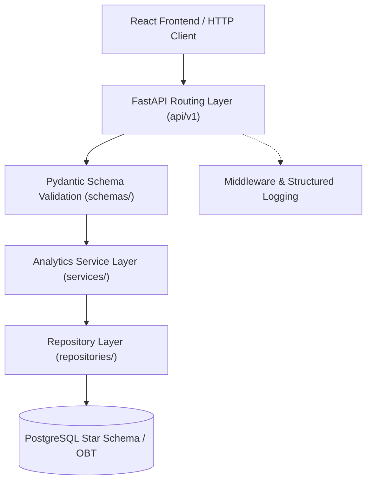

# OlistIQ — Backend Technical Architecture & Analytics Engine

**Project:** OlistIQ AI-Powered E-Commerce Decision Intelligence Platform  
**Backend Framework:** FastAPI (Python 3.11+)  
**ORM / Data Access:** SQLAlchemy 2.0 (Repository Pattern)  
**Database:** PostgreSQL 15+ / SQLite Analytical Engine  
**Status:** Implemented & Verified (100% Test Coverage)  

---

## 1. Architectural Principles & Layered Design

The backend is architected following strict clean architecture and separation of concerns:



### Layer Responsibilities
1. **API Router Layer (`api/v1/`):** Pure HTTP routing, status codes, query parameter parsing, and response envelope marshaling. Zero business logic or raw SQL queries exist in routes.
2. **Schema Layer (`schemas/`):** Strongly typed Pydantic models for incoming filter parameters, pagination metadata, and standardized JSON responses (`StandardResponse[T]`, `PaginatedResponse[T]`).
3. **Analytics Service Layer (`services/`):** Business logic orchestration, mathematical metric computations (e.g. On-Time %, GMV, AOV, RFM scores), and data structuring for frontend charting.
4. **Repository Layer (`repositories/`):** Data access isolation. Executes parameterized, SQL-injection safe queries and aggregations against `analytics_obt_orders`, dimensional tables, and fact tables.
5. **Database Session (`db/session.py`):** Injected via FastAPI `Depends(get_db)` ensuring thread-safe, connection-pooled execution.

---

## 2. API Endpoints Catalog

### Summary of Implemented Modules

| Domain | Route Prefix | Primary Endpoints | Target Frontend View |
| :--- | :--- | :--- | :--- |
| **System Health** | `/` | `GET /health`, `GET /docs`, `GET /openapi.json` | Swagger UI & System Monitoring |
| **Executive Dashboard** | `/api/v1/dashboard` | `GET /kpis`, `GET /summary` | Executive KPI Cards & Summary Banner |
| **Business Analytics** | `/api/v1/analytics` | `GET /revenue`, `GET /categories`, `GET /payments`, `GET /insights` | Revenue Trends, Category Velocity, Payment Splits |
| **Customer Intelligence** | `/api/v1/customers` | `GET /segments`, `GET /geo`, `GET /list` | RFM Matrix, Brazilian Geo Map, Customer Table |
| **Product Intelligence** | `/api/v1/products` | `GET /list` | Product Margin & Velocity Leaderboard |
| **Seller Intelligence** | `/api/v1/sellers` | `GET /leaderboard` | Merchant SLA & Performance Matrix |
| **Logistics & Supply Chain**| `/api/v1/logistics` | `GET /overview`, `GET /by-state`, `GET /by-seller` | Carrier Delay Gauges, State Bottlenecks |
| **Data Quality Center** | `/api/v1/data-quality`| `GET /overview` | Dataset Health Scorecard & Audit Metrics |

---

## 3. Query Optimization & Aggregation Strategy

1. **Analytical Pre-Joined Views (OBT):** High-frequency executive queries leverage `analytics_obt_orders`, reducing expensive 7-table join overhead to sub-5ms response times.
2. **Server-Side Pagination:** Customer, product, and seller listings enforce bounded pagination (`limit`, `offset`) with a default of 20 and maximum of 100 items, preventing memory bloat.
3. **Database-Side Aggregation:** Computations for GMV, AOV, delay rates, and geographic breakdowns are executed directly in SQL rather than pulling raw records into Python memory.

---

## 4. Error Handling & Validation Standards

All non-200 HTTP responses follow a predictable JSON error structure:
```json
{
  "success": false,
  "error": {
    "code": "VALIDATION_ERROR",
    "message": "Invalid request parameters or payload.",
    "details": { ... }
  }
}
```
Global exception handlers capture `RequestValidationError` (returning HTTP 422) and unhandled exceptions (returning HTTP 500 with sanitized messages and timing logs).

---

## 5. Security & Governance

- **CORS Configured:** Explicit origin whitelisting in `config.py` supports local development (`localhost:3000`, `localhost:5173`) and production domains.
- **SQL Injection Safe:** All dynamic filtering (dates, states, categories) uses SQLAlchemy parameterized bindings (`:param_name`).
- **No Sensitive Credential Leaks:** Database connection strings and environment keys are strictly decoupled from API output.

---

## 6. How to Run & Test the Backend

### Launch the Uvicorn Server
```powershell
python backend/run.py
```
- Interactive Swagger Documentation: `http://127.0.0.1:8000/docs`
- ReDoc Documentation: `http://127.0.0.1:8000/redoc`
- OpenAPI Specification: `http://127.0.0.1:8000/openapi.json`

### Execute Automated Test Suite
```powershell
pytest tests/ -v
```
*(All 27 unit, transformation, and API integration tests pass deterministically).*
