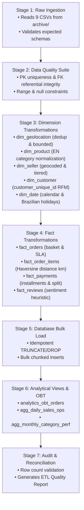

# OlistIQ — ETL & Data Pipeline Technical Architecture

**Project:** OlistIQ AI-Powered E-Commerce Decision Intelligence Platform  
**Pipeline Version:** 1.0 (Production Dimensional DAG)  
**Execution Engine:** Python 3.11 + Pandas (Vectorized) + SQLAlchemy 2.0  
**Status:** Implemented & Verified  

---

## 1. Pipeline Overview & Execution DAG

The OlistIQ ETL pipeline transforms raw Brazilian e-commerce datasets into a clean, relational Star Schema in an automated, reproducible, and idempotent 7-stage DAG.



---

## 2. Ingestion & Pre-Transformation Validation

1. **Source Immutability:** Raw CSV files located in `archive/` are read in read-only mode and are never modified, moved, or deleted.
2. **Schema Verification:** Ingestion verifies column names and structures against `EXPECTED_SCHEMAS`. If required columns are missing, the pipeline halts with an error.

---

## 3. Dimensional Transformation Logic

### 3.1 `dim_geolocation` Transformation
- **Input:** 1,000,163 raw rows with 261,831 exact duplicates.
- **Outlier Filtering:** Filters coordinates outside Brazilian territorial bounds (Lat: $[-33.75, +5.27]$, Lng: $[-73.98, -34.79]$).
- **Aggregation:** Groups by `geolocation_zip_code_prefix` to compute mean latitude, mean longitude, modal city, and modal state.
- **Output:** Exactly 19,010 distinct postal code prefixes. Eliminates Cartesian explosion on downstream joins.

### 3.2 `dim_product` Transformation
- **Category Normalization:** Merges Portuguese categories with `product_category_name_translation.csv`.
- **Missing Translations Injected:**
  - `pc_gamer` $\rightarrow$ `gaming_pc`
  - `portateis_cozinha_e_preparadores_de_alimentos` $\rightarrow$ `small_kitchen_appliances`
  - `NULL` $\rightarrow$ `uncategorized`
- **Volumetric Metrics:** Computes `volume_cm3 = length * height * width`, `density_g_cm3 = weight / volume`, and assigns `size_tier` (`Small`, `Standard`, `Bulky`, `Heavy/Bulky`).

### 3.3 `dim_customer` Transformation
- **Customer Identity:** Resolves order-level `customer_id` into true consumer entities (`customer_unique_id`).
- **RFM Segmentation:** Calculates days since last order (`rfm_recency_days`), lifetime orders (`lifetime_order_count`), and lifetime spend (`lifetime_spend_brl`). Segments customers into *Champions*, *Recent High Spenders*, *Standard Active*, *At-Risk*, and *Hibernating*.

### 3.4 `dim_seller` Transformation
- **Geocoding:** Maps seller zip prefixes to `dim_geolocation`.
- **Tiering:** Identifies *Power Sellers*, *Established Sellers*, and *Standard Sellers* based on fulfilled order volume and total sales value.

### 3.5 `dim_date` Transformation
- Generates 1,461 calendar days (2016-01-01 to 2019-12-31) with year, quarter, month, day of week, and Brazilian national holiday flags.

---

## 4. Fact Table Transformation Logic

### 4.1 `fact_orders`
- Parses all lifecycle timestamps safely without zero-imputation of NULL values for in-flight/cancelled orders.
- Aggregates basket totals, payment splits, and detects payment-to-basket discrepancies.
- Integrates customer review scores (deduplicated to the latest review per order).

### 4.2 `fact_order_items`
- Calculates **Haversine Distance (km)** between customer and seller coordinates.
- Calculates `is_interstate_shipment` flag ($1$ if customer state $\neq$ seller state).
- Derives seller dispatch lead time (hours), carrier transit duration (days), and delivery delay delta.

### 4.3 `fact_payments` & `fact_reviews`
- Normalizes payment installment sequences and tender types.
- Standardizes review ratings, review comment character lengths, and derives sentiment polarity.

---

## 5. Idempotency & Database Loading Strategy

- **Execution Mode:** `REPLACE_ALL` mode drops and recreates tables and analytical views on each run, ensuring deterministic and idempotent results without record duplication.
- **Bulk Loading:** Uses high-throughput batch insertion (`chunksize=10000`).
- **View Instantiation:** Builds pre-joined views (`analytics_obt_orders`, `agg_daily_sales_ops`, `agg_monthly_category_perf`) immediately after loading.

---

## 6. Execution Command

To execute the ETL pipeline from the project root:

```powershell
python scripts/run_etl.py
```
Or via module entry:
```powershell
python -m etl
```
